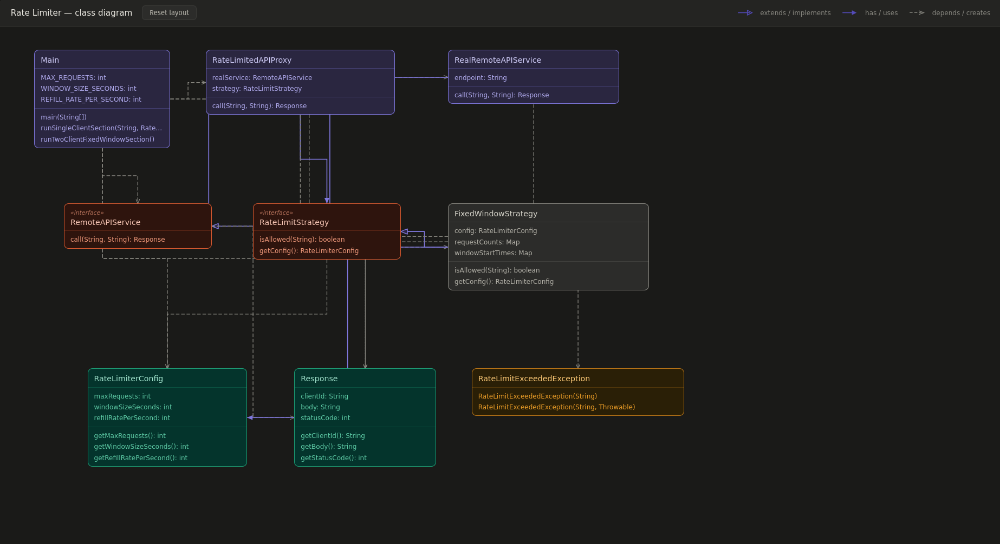

# Rate Limiter

Simple Java rate limiter system using the Proxy pattern with Fixed Window and Sliding Window strategies.
It demonstrates independent per-client quotas through a simple runnable console example.

## Class Diagram



## Run

```bash
cd "/home/sammyurfen/Codes/java/System Design/Rate Limiter"
mkdir -p out
javac -d out $(find src -name '*.java')
java -cp out com.ratelimiter.Main
```

